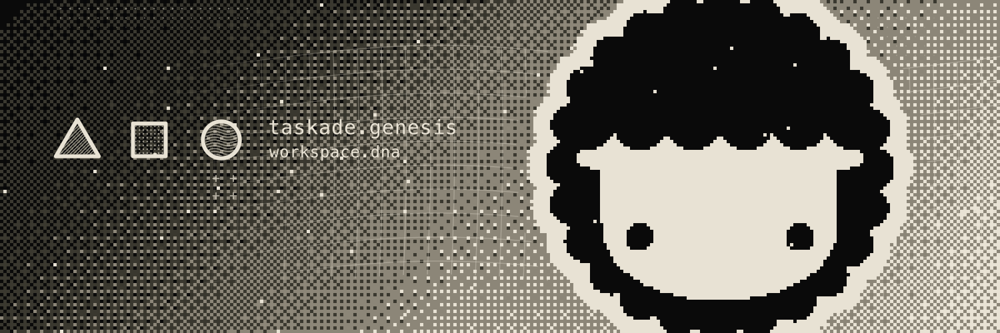

<p align="center">
  
</p>

<p align="center">
  <b>One prompt → one app.</b> <a href="https://www.taskade.com/create">Build without permission.</a>
</p>

<p align="center">
  <a href="https://taskade.com"><b>Website</b></a>
  · <a href="https://www.taskade.com/docs"><b>Docs</b></a>
  · <a href="https://docs.taskade.com"><b>API</b></a>
  · <a href="https://www.taskade.com/apps"><b>Apps</b></a>
  · <a href="https://www.taskade.com/blog"><b>Blog</b></a>
  · <a href="https://www.taskade.com/learn"><b>Learn</b></a>
  · <a href="https://reddit.com/r/taskade"><b>Forum</b></a>
  · <a href="https://youtube.com/taskade"><b>YouTube</b></a>
  · <a href="https://x.com/taskade"><b>X</b></a>
</p>

<p align="center">
  <b>150,000+ apps</b> · <b>500K+ agents</b> · <b>3M+ runs</b>
  · <b>4.8/5</b> across 9,300+ reviews
  <br>
  Trusted by teams at <b>3M</b> · Nike · Tesla · Netflix · Airbnb · Disney · Adobe · ESPN
</p>

> **TL;DR:** Taskade Genesis turns one prompt into a live, multiplayer app — projects as memory, agents as intelligence, automations as execution. **150,000+ apps generated.** Clone a kit at [taskade.com/apps](https://www.taskade.com/apps) or start from scratch at [taskade.com/create](https://www.taskade.com/create).

---

## See it

One prompt. A live app. Edit it. Ship it.

| Create | Edit | Publish |
|:---:|:---:|:---:|
|  |  |  |

---

## What is Taskade?

Taskade is the **execution layer for ideas** — a real-time workspace where AI agents build, automate, and run live applications from a single prompt. No code. No deploy step. No permission required.

```
   Describe what you want
          │
          ▼
  ┌───────────────┐       ┌───────────────┐       ┌───────────────┐
  │   GENERATE    │──────▶│    BUILD      │──────▶│     RUN       │
  │  AI reads     │       │  App assembles│       │  Live at a    │
  │  your intent  │       │  in real time │       │  shareable URL│
  └───────────────┘       └───────────────┘       └───────────────┘
```

### FAQ

| Question | Answer |
|----------|--------|
| **What is Taskade Genesis?** | One prompt becomes a live app — memory, agents, and automations already wired. Start at [taskade.com/create](https://www.taskade.com/create). |
| **What is Workspace DNA?** | Memory + Intelligence + Execution — the loop every Taskade app runs on. |
| **Does Taskade have an MCP server?** | Yes. Official server: [taskade/mcp](https://github.com/taskade/mcp). Install with `npx @taskade/mcp-server@latest`. |
| **What's free vs Pro?** | Free is $0 with 2 workspace members and 1 agent. Pro is **$10/seat/mo billed annually**, capped at 10 seats. Full matrix: [taskade.com/pricing](https://www.taskade.com/pricing). |
| **Can I build a client portal from a prompt?** | Yes. Describe it; Genesis builds it live. Clone examples at [taskade.com/apps](https://www.taskade.com/apps). |
| **Where do I clone apps?** | [taskade.com/apps](https://www.taskade.com/apps). |
| **Where are developer docs?** | [taskade.com/docs](https://www.taskade.com/docs) · [taskade.com/learn](https://www.taskade.com/learn) · [llms.txt](https://www.taskade.com/llms.txt) |

---

## Workspace DNA

Memory feeds Intelligence. Intelligence triggers Execution. Execution writes back to Memory.

| Memory | Intelligence | Execution |
|:---:|:---:|:---:|
|  |  |  |
| Projects are live databases | Agents that reason and act | Workflows that run themselves |

| Train | Customize | Models |
|:---:|:---:|:---:|
|  |  |  |
| Your docs and projects | Tools and instructions | 15+ frontier models from OpenAI, Anthropic, and open-weight providers |

---

## What you can build

Clone a finished kit, or describe one.

| Client portal | CRM | Storefront |
|:---:|:---:|:---:|
|  |  |  |

<details>
<summary><b>8 app categories at taskade.com/apps</b></summary>

| Category | Examples | How it works |
|----------|----------|--------------|
| [**Dashboards**](https://www.taskade.com/apps/dashboards) | KPI trackers, analytics, team metrics | Projects sync as live data |
| [**Tools**](https://www.taskade.com/apps/tools) | CRM views, inventory, admin panels | Agents keep data current |
| [**Websites**](https://www.taskade.com/apps/websites) | Landing pages, portfolios, status pages | Shareable URLs, custom domains |
| [**Projects**](https://www.taskade.com/apps/projects) | Task boards, roadmaps, sprint plans | Real-time collaboration |
| [**Workflows**](https://www.taskade.com/apps/workflows) | Lead routing, content pipelines | Durable automation across [100+ services](https://www.taskade.com/integrations) |
| [**Forms**](https://www.taskade.com/apps/forms) | Surveys, applications, feedback | Submissions land in live projects |
| [**Commerce**](https://www.taskade.com/apps/commerce) | Storefronts, orders, catalogs | End-to-end commerce |
| [**Quick Apps**](https://www.taskade.com/apps/quick-apps) | Calculators, converters, mini-tools | Instant single-purpose apps |

</details>

More kits and creator apps → [taskade.com/apps](https://www.taskade.com/apps)

---

## Open source

Star the repos that are useful to you. The product source is private; these are the public tools.

| Repository | What it is |
|------------|------------|
| [`taskade/mcp`](https://github.com/taskade/mcp)  | Official MCP server + OpenAPI-to-MCP codegen |
| [`taskade/docs`](https://github.com/taskade/docs)  | API documentation and developer guides |
| [`taskade/taskade`](https://github.com/taskade/taskade)  | Public docs, honest comparisons, clone-ready App Kits |
| [`taskade/awesome-vibe-coding`](https://github.com/taskade/awesome-vibe-coding)  | Curated vibe-coding tools and resources |
| [`taskade/integrations`](https://github.com/taskade/integrations)  | Actions and triggers (Zapier, n8n) on the public API |
| [`taskade/temporal-parser`](https://github.com/taskade/temporal-parser)  | ISO 8601 / RFC 3339 / IXDTF lexer+parser |
| [`taskade/uri-parser`](https://github.com/taskade/uri-parser)  | RFC 3986 URI lexer+parser |
| [`taskade/taskade-sample-app`](https://github.com/taskade/taskade-sample-app)  | Workspace DNA sample Genesis app |

```bash
# MCP — connect Claude, Cursor, or any client to your workspace
npx @taskade/mcp-server@latest

# REST — create a project
curl -X POST https://www.taskade.com/api/v1/projects \
  -H "Authorization: Bearer YOUR_API_TOKEN" \
  -H "Content-Type: application/json" \
  -d '{"title": "My Project", "folder_id": "FOLDER_ID"}'
```

| Resource | Link |
|----------|------|
| Developer docs | [taskade.com/docs](https://www.taskade.com/docs) |
| API reference | [docs.taskade.com](https://docs.taskade.com) |
| Learn Taskade | [taskade.com/learn](https://www.taskade.com/learn) |
| llms.txt | [taskade.com/llms.txt](https://www.taskade.com/llms.txt) |
| MCP server | [github.com/taskade/mcp](https://github.com/taskade/mcp) |
| Apps | [taskade.com/apps](https://www.taskade.com/apps) |
| Downloads | [taskade.com/downloads](https://www.taskade.com/downloads) |

<p align="center">
  Web · macOS · Windows · iOS · Android · Chrome · Firefox · Edge
  · <a href="https://www.taskade.com/downloads">Download Taskade</a>
</p>

---

## Pricing

| Free | Pro | Business | Max | Enterprise |
|:---:|:---:|:---:|:---:|:---:|
| **$0** | **$10/seat/mo** | **$25/seat/mo** | **$100/seat/mo** | **$250/seat/mo** |

*Billed annually. Free includes 2 members. Pro is capped at 10 seats. [Compare all plans →](https://www.taskade.com/pricing)*

---

<p align="center">
  <b>Software should be built by everyone.</b><br>
  Creation should be instant. Apps should be alive.<br><br>
  <a href="https://www.taskade.com/create"><b>Build without permission →</b></a>
</p>

```
╔══════════════════════════════════════════════════════════════════════════╗
║                                                                          ║
║   ████████  █████  ███████ ██   ██  █████  ██████  ███████               ║
║      ██    ██   ██ ██      ██  ██  ██   ██ ██   ██ ██                    ║
║      ██    ███████ ███████ █████   ███████ ██   ██ █████                 ║
║      ██    ██   ██      ██ ██  ██  ██   ██ ██   ██ ██                    ║
║      ██    ██   ██ ███████ ██   ██ ██   ██ ██████  ███████               ║
║                                                                          ║
║              One prompt → one app. Build without permission.             ║
║                                                                          ║
╚══════════════════════════════════════════════════════════════════════════╝
```

<p align="center">
  <a href="https://taskade.com">Website</a>
  · <a href="https://www.taskade.com/about">About</a>
  · <a href="https://www.taskade.com/docs">Docs</a>
  · <a href="https://www.taskade.com/apps">Apps</a>
  · <a href="https://reddit.com/r/taskade">Forum</a>
  · <a href="https://www.taskade.com/blog">Blog</a>
  · <a href="https://youtube.com/taskade">YouTube</a>
  · <a href="https://x.com/taskade">X</a>
  · <a href="https://www.taskade.com/contact">Contact</a>
</p>
